# 🧪 Cloud Computing Lab Experiments

## 1. Cloud Service Provision (CSP)

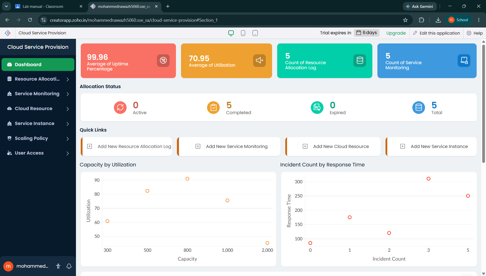

---

## 2. Flight Reservation System (FRS)

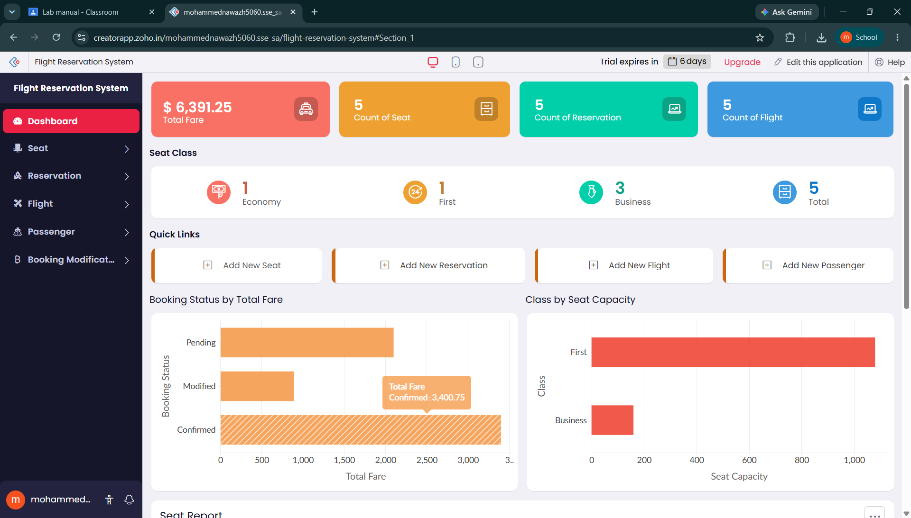

---

## 3. Property Management System (PMS)

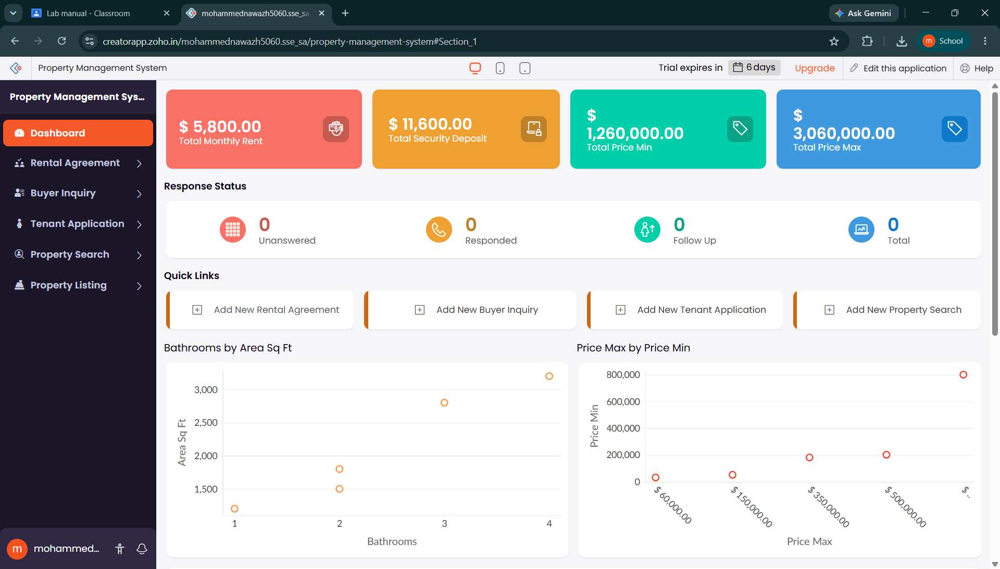

---

## 4. Car Booking Reservation (CBR)

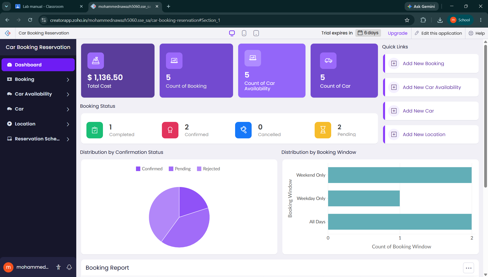

---

## 5. Library Book Reservation (LBR)

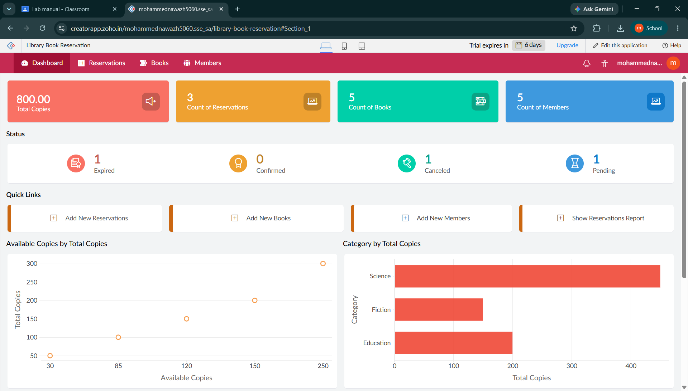

---

## 6. Product Sales Management (PSM)

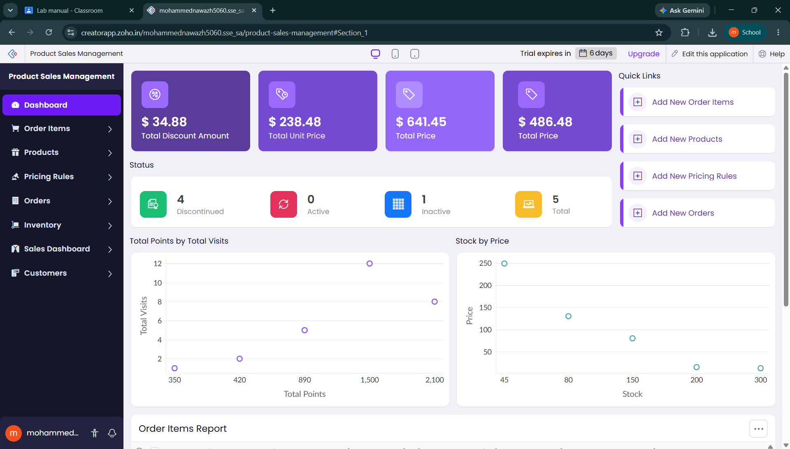

---

## 7. Virtual Machine Management (VMM)

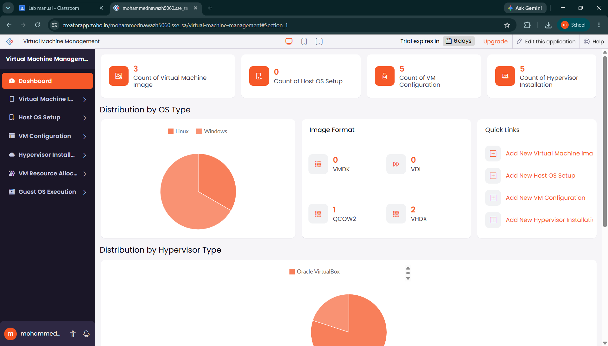

---

## 8. Virtual Machine Provisioning (VMP)

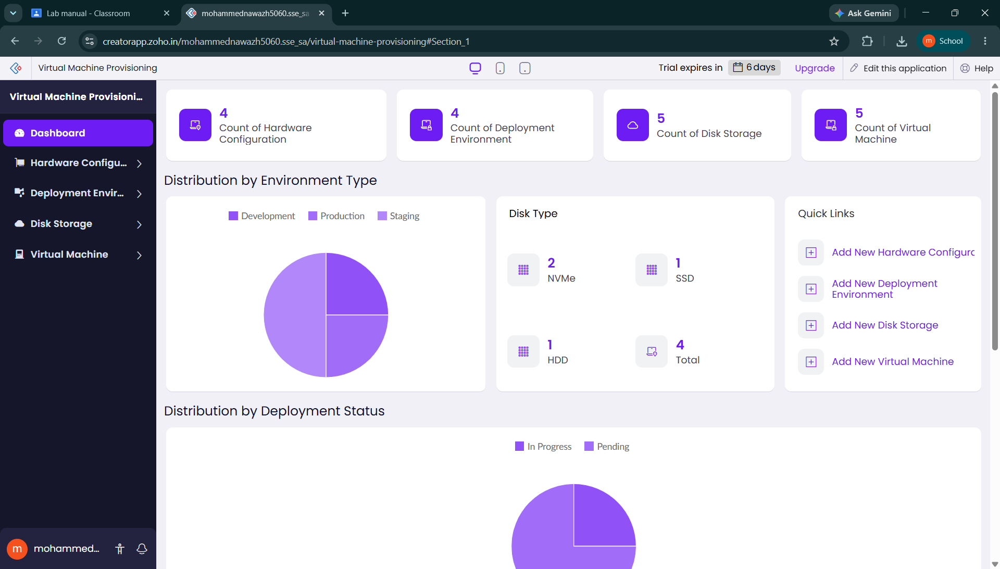

---

## 9. Virtual Disk Management (VDM)

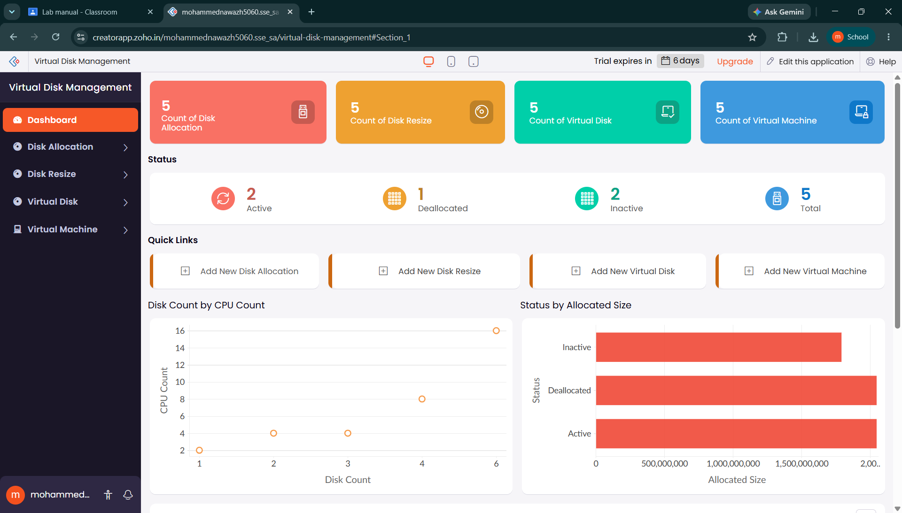

---

## 10. Virtual Machine Snapshot Management (VMS)

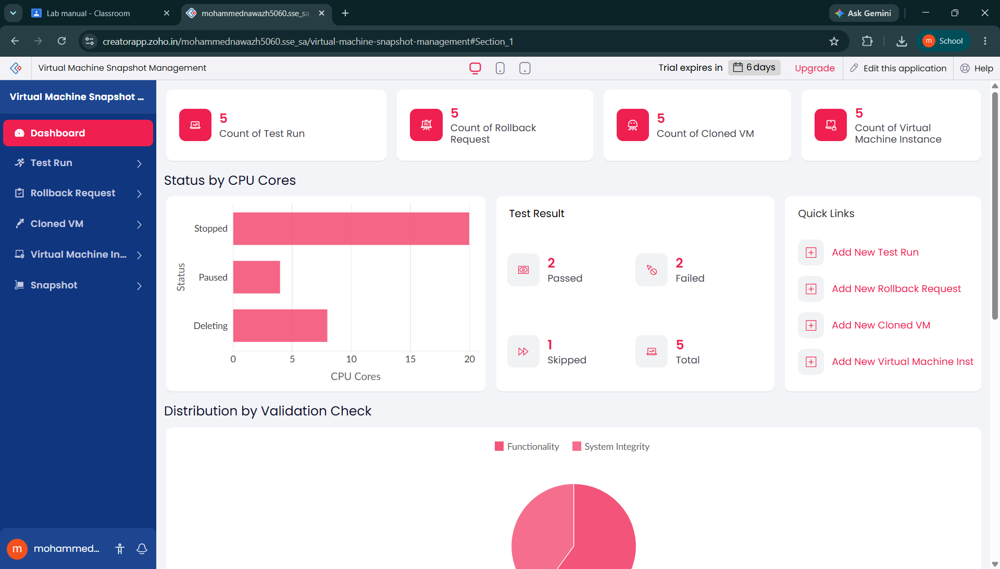

---

## 11. Virtual Machine Cloning (VMC)

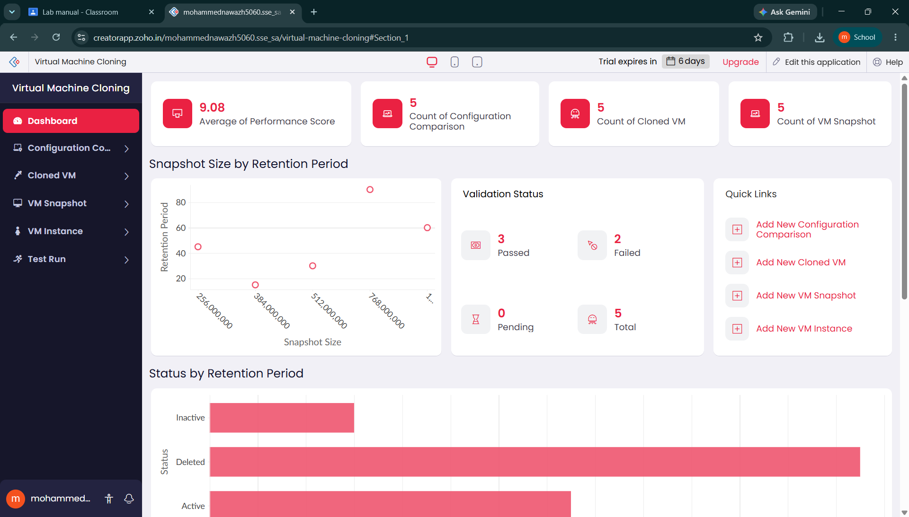

---

## 12. Virtual Machine Hardware Configuration (VMH)

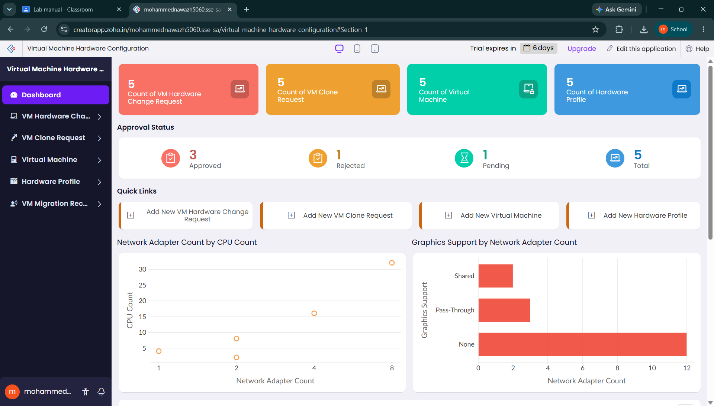
