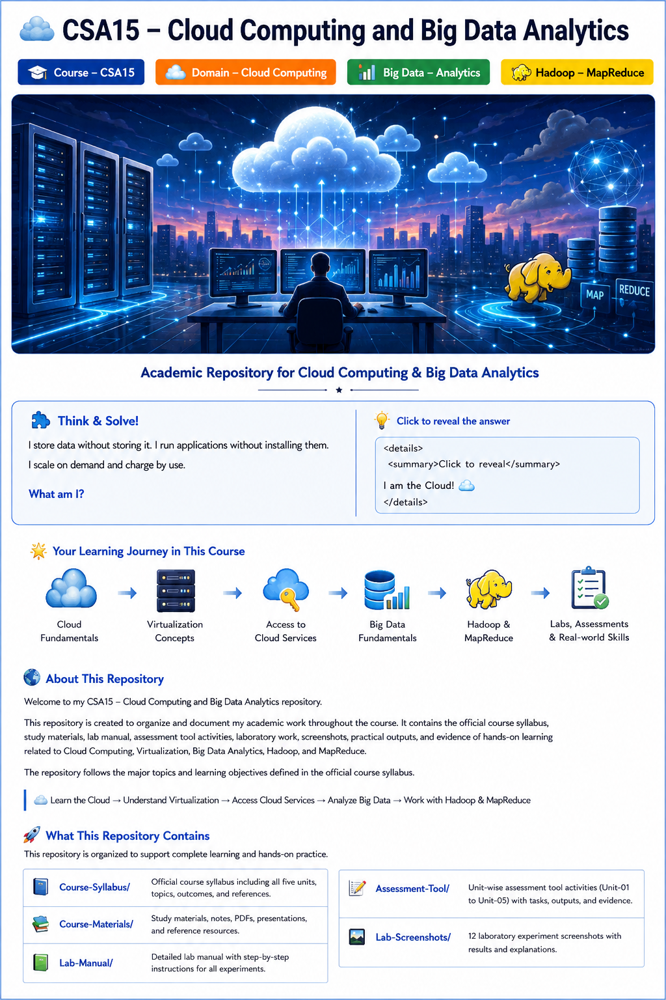

# ☁️ CSA15 - Cloud Computing and Big Data Analytics

<p align="center">
  
</p>


<p align="center">


</p>

<p align="center">
  
</p>

> ### 🧩 Can You Solve the Cloud Puzzle?
>
> **I can store data, run applications, create virtual machines, and process huge datasets.**
>
> **I can provide infrastructure, platforms, or software.**
>
> **I can scale without you owning the physical hardware.**
>
> 🔎 **What am I?**
>
> <details>
> <summary>💡 Reveal the answer</summary>
>
> **Answer: ☁️ Cloud Computing**
>
> </details>
>
> ### ⚡ Follow the Journey
>
> ```text
> ☁️ CLOUD
>    ↓
> 🖥️ VIRTUALIZATION
>    ↓
> 🌐 CLOUD SERVICES
>    ↓
> 📊 BIG DATA
>    ↓
> 🐘 HADOOP
>    ↓
> ⚙️ MAPREDUCE
>    ↓
> 🧪 PRACTICAL LABS
> ```
>
> <p align="center">
>   <b>Think Cloud ☁️ • Build Skills 🧠 • Analyze Data 📊 • Practice 🧪</b>
> </p>

---


<p align="center">


</p>

<p align="center">
  <b>Academic Repository for Cloud Computing & Big Data Analytics</b>
</p>

---

## 🌐 About This Repository

Welcome to my **CSA15 - Cloud Computing and Big Data Analytics** repository.

This repository is created to organize and document my academic work throughout the course. It contains **the official course syllabus, course materials, laboratory manual, unit-wise Assessment Tool activities, 12 laboratory experiments, screenshots, practical outputs, and evidence of hands-on learning** related to Cloud Computing, Virtualization, Big Data Analytics, Hadoop, and MapReduce.

The repository follows the major topics and learning objectives defined in the official course syllabus.

> ☁️ **Learn the Cloud → Understand Virtualization → Access Cloud Services → Analyze Big Data → Work with Hadoop & MapReduce**

---

## 🎯 Course Overview

**Course Code:** CSA15
**Course:** Cloud Computing and Big Data Analytics
**Course Type:** Core Course
**Prerequisites:** Database Management Systems / Computer Networks

The course introduces the fundamental concepts of cloud computing technologies, cloud service models, virtualization, cloud platforms, Big Data Analytics, Hadoop architecture, and MapReduce.

The syllabus aims to develop both **conceptual understanding and practical knowledge** of modern cloud and big-data technologies.

---

# 🚀 What This Repository Contains

This repository brings together the major academic resources, assessment activities, laboratory work, and practical evidence for the course.

### 📄 Course Syllabus

Contains the official syllabus for **CSA15 - Cloud Computing and Big Data Analytics**, including the five units, course topics, outcomes, textbooks, and references.

📁 Location:

```text
Course-Syllabus/
```

### 📚 Course Materials

Contains supporting learning resources used throughout the course, such as notes, PDFs, presentations, references, and additional study materials.

📁 Location:

```text
Course-Materials/
```

### 📖 Lab Manual

Contains the laboratory manual and practical instructions used for the Cloud Computing laboratory.

📁 Location:

```text
Lab-Manual/
```

### 📝 Assessment Tool

Contains the assessment work completed throughout the course. Assessments are organized **unit-wise** according to the five units of the syllabus.

📁 Location:

```text
Assessment-Tool/
├── Unit-01/
├── Unit-02/
├── Unit-03/
├── Unit-04/
└── Unit-05/
```

Each unit can contain multiple assessment folders with completed activities, supporting files, screenshots, and outputs.

### 🧪 Lab Screenshots

Contains practical screenshots from the **12 Cloud Computing laboratory experiments**.

The screenshots are stored directly inside the `Lab-Screenshots/` folder, making the practical evidence easy to access.

The folder also contains a dedicated `README.md` that displays the experiment names together with their corresponding images.

📁 Location:

```text
Lab-Screenshots/
├── Lab-Experiments_1.png
├── Lab-Experiments_2.png
├── Lab-Experiments_3.png
├── Lab-Experiments_4.png
├── Lab-Experiments_5.png
├── Lab-Experiments_6.png
├── Lab-Experiments_7.png
├── Lab-Experiments_8.png
├── Lab-Experiments_9.png
├── Lab-Experiments_10.png
├── Lab-Experiments_11.png
├── Lab-Experiments_12.png
└── README.md
```

---

## 🖼️ Visual Course Map

<p align="center">
  
</p>

# 📚 Course Learning Journey

The course is divided into **five major units**, taking the learner from the fundamentals of cloud computing to Hadoop and MapReduce.

```text
                  ☁️ CLOUD COMPUTING
                         │
                         ▼
              ┌─────────────────────┐
              │ UNIT I              │
              │ Cloud & Services    │
              └──────────┬──────────┘
                         │
                         ▼
              ┌─────────────────────┐
              │ UNIT II             │
              │ Virtualization      │
              │ Fundamentals        │
              └──────────┬──────────┘
                         │
                         ▼
              ┌─────────────────────┐
              │ UNIT III            │
              │ Access to Cloud     │
              └──────────┬──────────┘
                         │
                         ▼
              ┌─────────────────────┐
              │ UNIT IV             │
              │ Fundamentals of     │
              │ Big Data            │
              └──────────┬──────────┘
                         │
                         ▼
              ┌─────────────────────┐
              │ UNIT V              │
              │ Hadoop & MapReduce  │
              └─────────────────────┘
```

---

# ☁️ UNIT I - Cloud and Services

The first unit introduces the foundation of Cloud Computing.

### Topics Covered

* Introduction to Cloud Computing
* Evolution of Cloud Computing
* Hardware Evolution
* Internet Software Evolution
* Server Virtualization
* Web Services Overview
* Infrastructure as a Service - **IaaS**
* Platform as a Service - **PaaS**
* Software as a Service - **SaaS**
* Everything as a Service - **XaaS**

### 🔑 Key Concept

```text
IaaS  → Infrastructure
PaaS  → Platform
SaaS  → Software
XaaS  → Everything as a Service
```

The unit focuses on understanding cloud technologies and the different service models used to provide computing resources over the internet.

---

# 🖥️ UNIT II - Virtualization Fundamentals

Virtualization is one of the important technologies behind modern cloud infrastructure.

### Topics Covered

* Virtualization Architecture
* Hypervisors
* Security Problems in Virtualization
* Cloud Datacenter Architecture
* Software Defined Datacenter
* Service Oriented Architecture
* Cloud Federation
* Presence
* Identity
* Privacy

### 💡 Core Idea

```text
Physical Hardware
       ↓
Virtualization Layer
       ↓
Virtual Machines
       ↓
Cloud Services
```

This unit helps understand how physical computing resources can be abstracted and managed through virtualization technologies.

---

# 🌍 UNIT III - Access to Cloud

This unit focuses on how users, applications, networks, and services interact with cloud environments.

### Topics Covered

* Hardware and Infrastructure
* Clients
* Security
* Networks
* Services
* Accessing the Cloud
* Cloud Platforms
* Web Applications
* Web APIs
* Web Browsers
* Cloud Storage
* Storage Area Network Architecture
* Collaboration within the Cloud
* Standards
* Driving Forces
* Software and Services
* Developing Applications

### 🔗 Cloud Access Flow

```text
User
  ↓
Client / Browser
  ↓
Network
  ↓
Cloud Platform
  ↓
Cloud Service
  ↓
Application / Storage
```

The unit also introduces cloud storage, collaboration, web APIs, and application development concepts.

---

# 📊 UNIT IV - Fundamentals of Big Data

Cloud Computing provides scalable infrastructure, while Big Data focuses on handling and analyzing extremely large and complex datasets.

### Topics Covered

* Introduction to Big Data
* Distributed File Systems
* Structured Data
* Unstructured Data
* Importance of Big Data
* The **5Vs of Big Data**
* Drivers for Big Data
* Big Data Analytics
* Data Appliances
* Integration Tools
* Big Data Security
* Issues in Big Data
* Big Data Applications

### 🔥 The 5Vs of Big Data

```text
              BIG DATA
                  │
       ┌──────────┼──────────┐
       │          │          │
    Volume     Velocity    Variety
       │          │          │
       └──────┬───┴────┬─────┘
              │        │
           Veracity   Value
```

Understanding these characteristics helps explain why traditional data-processing approaches may not be sufficient for modern large-scale datasets.

---

# 🐘 UNIT V - Hadoop and MapReduce Architecture

The final unit introduces **Apache Hadoop**, its ecosystem, HDFS, MapReduce, YARN, and related concepts.

### Topics Covered

* Big Data
* Apache Hadoop
* Hadoop Ecosystem
* Hadoop Streaming
* HDFS Concepts
* Interface to HDFS
* Moving Data In and Out of Hadoop
* Introduction to MapReduce
* MapReduce Algorithm
* MapReduce Architecture
* MapReduce Inputs and Outputs
* Anatomy of a MapReduce Job
* Failures in Classical MapReduce
* YARN
* Job Scheduling
* Data Serialization

### ⚙️ Hadoop Concept

```text
                BIG DATA
                    │
                    ▼
              ┌───────────┐
              │  HADOOP   │
              └─────┬─────┘
                    │
          ┌─────────┴─────────┐
          ▼                   ▼
       HDFS                MapReduce
          │                   │
     Distributed          Processing
       Storage              Engine
          │                   │
          └─────────┬─────────┘
                    ▼
                 YARN
                    │
                    ▼
              Job Management
```

The syllabus specifically covers Hadoop architecture, the Hadoop ecosystem, HDFS, MapReduce processing, job execution, failures, YARN, scheduling, and serialization.

---

# 🧪 Laboratory Work

The **Lab-Screenshots** section documents the practical side of the course through **12 laboratory experiments**.

The practical workflow follows:

```text
Lab Manual
    ↓
Understand Experiment
    ↓
Configuration
    ↓
Execution
    ↓
Output
    ↓
Screenshot
    ↓
GitHub Documentation
```

### 📸 12 Laboratory Experiments

| No. | Experiment | Code |
|---:|---|---|
| 01 | Cloud Service Provision | CSP |
| 02 | Flight Reservation System | FRS |
| 03 | Property Management System | PMS |
| 04 | Car Booking Reservation | CBR |
| 05 | Library Book Reservation | LBR |
| 06 | Product Sales Management | PSM |
| 07 | Virtual Machine Management | VMM |
| 08 | Virtual Machine Provisioning | VMP |
| 09 | Virtual Disk Management | VDM |
| 10 | Virtual Machine Snapshot Management | VMS |
| 11 | Virtual Machine Cloning | VMC |
| 12 | Virtual Machine Hardware Configuration | VMH |

### 📸 Lab Screenshot Organization

The screenshots are stored directly inside the `Lab-Screenshots/` folder.

```text
Lab-Screenshots/
│
├── Lab-Experiments_1.png
├── Lab-Experiments_2.png
├── Lab-Experiments_3.png
├── Lab-Experiments_4.png
├── Lab-Experiments_5.png
├── Lab-Experiments_6.png
├── Lab-Experiments_7.png
├── Lab-Experiments_8.png
├── Lab-Experiments_9.png
├── Lab-Experiments_10.png
├── Lab-Experiments_11.png
├── Lab-Experiments_12.png
└── README.md
```

The `README.md` inside this folder provides a visual presentation of the experiments, showing the experiment names with their corresponding screenshots.

Screenshots are maintained as practical evidence of the work performed during the laboratory sessions.

---

# 📝 Assessment Tool

The **Assessment-Tool** directory contains assessment activities completed as part of the course.

The assessment work is organized **unit-wise**, matching the five units of the syllabus.

```text
Assessment-Tool/
│
├── Unit-01/
│   ├── Assessment-01/
│   ├── Assessment-02/
│   └── ...
│
├── Unit-02/
│   ├── Assessment-01/
│   ├── Assessment-02/
│   └── ...
│
├── Unit-03/
│   ├── Assessment-01/
│   ├── Assessment-02/
│   └── ...
│
├── Unit-04/
│   ├── Assessment-01/
│   ├── Assessment-02/
│   └── ...
│
└── Unit-05/
    ├── Assessment-01/
    ├── Assessment-02/
    └── ...
```

Each assessment can contain:

* 📸 Screenshots
* 💻 Practical outputs
* 📄 Supporting files
* ✅ Completed activities

### 📘 Unit 01 Assessments

Assessments related to **Cloud and Services**, including cloud fundamentals, service models, web services, and server virtualization.

### 📗 Unit 02 Assessments

Assessments related to **Virtualization Fundamentals**, including virtualization architecture, hypervisors, datacenters, federation, identity, and privacy.

### 📙 Unit 03 Assessments

Assessments related to **Access to Cloud**, including clients, networks, cloud platforms, web applications, APIs, storage, and application development.

### 📕 Unit 04 Assessments

Assessments related to **Fundamentals of Big Data**, including Big Data characteristics, the 5Vs, analytics, security, and applications.

### 📓 Unit 05 Assessments

Assessments related to **Hadoop and MapReduce Architecture**, including HDFS, MapReduce, YARN, job scheduling, and data serialization.

---

# 🎓 Course Outcomes

By completing this course, the syllabus expects students to develop the ability to:

* Identify and select appropriate cloud services and service models.
* Understand virtualization and cloud data-center architecture.
* Understand methods of accessing cloud services and collaboration techniques.
* Analyze problems associated with Big Data.
* Understand Hadoop architecture and execute MapReduce applications.
* Identify applications of Cloud Services, Big Data Analytics, and Hadoop.
* Understand resource provisioning using VMware Workstation and Cloud Service Providers.
* Select suitable cloud deployment services and Big Data Analytics approaches for real-time problems.

---

# 🧠 Skills Developed

Through the course and practical activities, this repository tracks learning in areas such as:

| Area               | Concepts                                          |
| ------------------ | ------------------------------------------------- |
| ☁️ Cloud Computing | Cloud fundamentals, services, deployment concepts |
| 🖥️ Virtualization | Architecture, hypervisors, virtual machines       |
| 🌐 Cloud Access    | Networks, clients, platforms, APIs                |
| 💾 Cloud Storage   | Storage architecture and cloud storage            |
| 📊 Big Data        | 5Vs, analytics, security, applications            |
| 🐘 Hadoop          | Hadoop ecosystem and HDFS                         |
| ⚙️ MapReduce       | Algorithms, jobs, inputs and outputs              |
| 🔐 Security        | Cloud and Big Data security                       |
| 🏗️ Infrastructure | Datacenters and resource provisioning             |

---

# 📁 Repository Structure

The repository is organized into course resources, unit-wise assessments, and laboratory evidence.

```text
CSA1521_CLOUD_COMPUTING/
│
├── 📄 README.md
│
├── 📚 Course-Syllabus/
│   └── Syllabus PDF
│
├── 📖 Lab-Manual/
│   └── Lab Manual PDF
│
├── 📦 Course-Materials/
│   └── Course Learning Materials
│
├── 📝 Assessment-Tool/
│   │
│   ├── Unit-01/
│   │   ├── Assessment-01/
│   │   ├── Assessment-02/
│   │   └── ...
│   │
│   ├── Unit-02/
│   │   ├── Assessment-01/
│   │   ├── Assessment-02/
│   │   └── ...
│   │
│   ├── Unit-03/
│   │   ├── Assessment-01/
│   │   ├── Assessment-02/
│   │   └── ...
│   │
│   ├── Unit-04/
│   │   ├── Assessment-01/
│   │   ├── Assessment-02/
│   │   └── ...
│   │
│   └── Unit-05/
│       ├── Assessment-01/
│       ├── Assessment-02/
│       └── ...
│
└── 🧪 Lab-Screenshots/
    │
    ├── Lab-Experiments_1.png
    ├── Lab-Experiments_2.png
    ├── Lab-Experiments_3.png
    ├── Lab-Experiments_4.png
    ├── Lab-Experiments_5.png
    ├── Lab-Experiments_6.png
    ├── Lab-Experiments_7.png
    ├── Lab-Experiments_8.png
    ├── Lab-Experiments_9.png
    ├── Lab-Experiments_10.png
    ├── Lab-Experiments_11.png
    ├── Lab-Experiments_12.png
    └── README.md
```

---

# 📈 Learning Progress

| Component                       | Status         |
| ------------------------------- | -------------- |
| ☁️ Cloud Computing Fundamentals | 🔄 Learning    |
| 🖥️ Virtualization              | 🔄 Learning    |
| 🌍 Cloud Access                 | 🔄 Learning    |
| 📊 Big Data Analytics           | 🔄 Learning    |
| 🐘 Hadoop                       | 🔄 Learning    |
| ⚙️ MapReduce                    | 🔄 Learning    |
| 📄 Course Syllabus              | ✅ Added       |
| 📖 Lab Manual                   | ✅ Added       |
| 📚 Course Materials             | 🔄 Updating    |
| 📝 Unit-wise Assessments        | 🔄 In Progress |
| 🧪 12 Laboratory Experiments    | ✅ Added       |
| 📸 Lab Screenshots              | ✅ Added       |
| 📋 Documentation                | 🔄 Updating    |

> The progress section can be updated as the course work is completed.

---

# 📚 Recommended Textbooks

The official syllabus recommends the following textbooks:

1. **Cloud Computing: Implementation, Management, and Security**
   John Rittinghouse and James Ransome

2. **Cloud Computing - A Practical Approach**
   Toby Velte, Anthony Velte and Robert Elsenpeter

3. **Professional Hadoop Solutions**
   Boris Lublinsky, Kevin T. Smith and Alexey Yakubovich

4. **Understanding Big Data**
   Chris Eaton, Dirk deRoos et al.

---

# 🔗 Quick Navigation

| Section | Purpose |
|---|---|
| 📄 [Course Syllabus](./Course-Syllabus) | Official course syllabus |
| 📚 [Course Materials](./Course-Materials) | Notes and supporting learning resources |
| 📖 [Lab Manual](./Lab-Manual) | Laboratory reference and instructions |
| 📝 [Assessment Tool](./Assessment-Tool) | Unit-wise assessment activities |
| 🧪 [Lab Screenshots](./Lab-Screenshots) | 12 laboratory experiment screenshots |

---

# 🔗 Course Roadmap

```text
Cloud Fundamentals
        ↓
Cloud Service Models
        ↓
Virtualization
        ↓
Cloud Infrastructure
        ↓
Cloud Access & Storage
        ↓
Big Data Fundamentals
        ↓
Big Data Analytics
        ↓
Apache Hadoop
        ↓
HDFS
        ↓
MapReduce
        ↓
YARN & Job Scheduling
        ↓
Real-World Cloud + Big Data Solutions
```

---

# 💡 Why This Repository?

This repository serves as a **digital record of my Cloud Computing and Big Data Analytics learning journey**.

Instead of keeping the syllabus, course materials, laboratory manual, assessments, laboratory screenshots, and practical evidence separately, everything related to the course is organized here in a structured and accessible format.

The goal is to maintain a clear record of:

**Learn → Practice → Implement → Capture → Organize → Review**

---

# 👨‍💻 Student

**Mohammed Nawaz**

**Program:** B.Tech - Artificial Intelligence and Machine Learning

**Course:** CSA15 - Cloud Computing and Big Data Analytics

---

## ⭐ Repository Status

```text
Course Status  : 🟢 Active
Syllabus       : ✅ Added
Lab Manual     : ✅ Added
Materials      : 🔄 Updating
Assessments    : 🔄 In Progress
12 Lab Experiments : ✅ Added
Lab Screenshots: ✅ Added
Documentation  : 🔄 Updating
```

---

<p align="center">

### ☁️ Learn Cloud. Analyze Data. Build the Future. 🐘

**CSA15 - Cloud Computing and Big Data Analytics**

</p>
